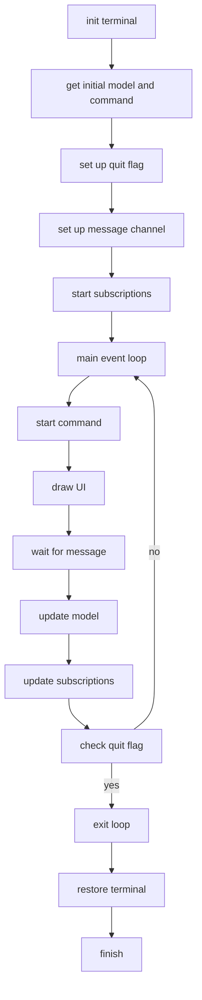

# Rustey

TUIs with Ratatui and the Elm architecture.

## Components

The Elm Architecture consists of a small number of components that play nicely
together. The core element is the model. When the application starts the `init`
function is called to retrieve the initial model. After initialization the
`view` function is called to render the user interface. Once rendering is done
the application will wait for events. Events are emitted by the functions the
application is subscribed to. The `subscriptions` function will emit a number
of such functions based on the state of the model. Each function will run in a
thread of it's own and emit events as relevant.

The model is updated by the `update` function as it reacts to messages. After
each update the `subscriptions` function is called again allowing the update of
which subscriptions are runningl.

Apart from the subscription the model may also return a command, which is a
task that will be executed asynchronously using threads. When the task is
complete it may emit an event for the update function to handle.

## Usage

To use Rustey in your project, add `rustey, ratatui` and `crossterm` to your
`Cargo.toml` file:

```sh
cargo add rustey ratatui crossterm
```

The first thing you need to do is to create a model. The model is a struct that
contains the state of your application. You can create a model like this:

```rust
struct Model {
  counter: i32,
}
```

You will then need to define which messages the application can handle. Messages are
the events that the application can react to. You can define messages like this:

```rust
enum Msg {
  Increment,
  Decrement,
  Quit,
}
```

With the model and the messages in place you can define an application struct.

```rust
struct MyApp {}
```

And then implement the `RusteyApp` trait for your application. The `RusteyApp` trait for the application struct:

```rust
impl RusteyApp<Model, Msg> for MyApp {
    fn init(&self) -> (Model, Cmd<Msg>) {
        (Model { counter: 0 }, Cmd::None)
    }

    fn subscriptions(&self, _model: &Model) -> Subscriptions<Msg> {
        vec![Box::new(UserInput {})]
    }

    fn update(&self, model: &mut Model, msg: Msg, quit_flag: &QuitFlag) -> Cmd<Msg> {
        match msg {
            Msg::Increment => {
                model.counter += 1;
                Cmd::None
            }
            Msg::Decrement => {
                model.counter -= 1;
                Cmd::None
            }
            Msg::Quit => {
                quit_flag.raise();
                Cmd::None
            }
        }
    }

    fn view(&self, frame: &mut Frame, model: &mut Model) {
        let text = format!("Counter: {}", model.counter);
        let paragraph = Paragraph::new(text).block(Block::default().borders(Borders::ALL));
        frame.render_widget(paragraph, frame.area());
    }
}

#[derive(Debug, PartialEq)]
pub struct UserInput {}

impl UserInput {
    fn process_event(&self, sender: &Sender<Msg>) {
        let event = event::read().unwrap();
        if let Event::Key(key) = event {
            if let Some(msg) = self.map_key(key.code) {
                let _ = sender.send(msg);
            }
        }
    }

    fn map_key(&self, key: KeyCode) -> Option<Msg> {
        match key {
            KeyCode::Char('+') => Some(Msg::Increment),
            KeyCode::Char('-') => Some(Msg::Decrement),
            KeyCode::Char('q') => Some(Msg::Quit),
            _ => None,
        }
    }
}

impl Subscription<Msg> for UserInput {
    fn run(&self, sender: Sender<Msg>, halt_flag: QuitFlag) {
        loop {
            if halt_flag.raised() {
                break;
            }

            let poll = poll(Duration::from_millis(50));
            if let Ok(true) = poll {
                self.process_event(&sender);
            }
        }
    }
}
```

With all this setup we're ready to run the application. The `main` function
will look like this:

```rust
fn main() -> std::io::Result<()> {
    let app = MyApp {};
    rustey::run(&app)?;
    Ok(())
}
```

And with this we have a full implementation of a TUI counter application in
less than 100 lines of code.

## Run loop

The main loop is initialized and runs like this:



## Example application

An example application can be found at https://github.com/jacobat/rustey_list
